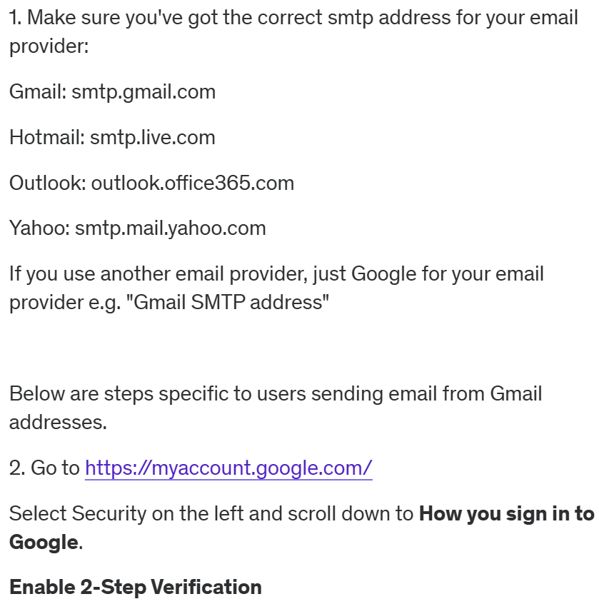

# International Space Station tracker

## This project is created using python, pycharm IDE, API's.

## Steps to run the project

 
 

4. Install python 3.12
5. Open project in the python IDE
6. Install requests module
7. Replace MY_EMAIL with your email.
8. After you generated the password, paste it to MY_PASSWORD in main.py, remember to remove the spaces in the generated password.
9. Add your latitude and langitude in MY_LAT and MY_LONG, go to [latlong](https://www.latlong.net/) to find you co-ordinates.
10. Run main.py and left your system ON or host the code on the cloud

**Hosting the code on cloud to run it daily**

11. Log on to [pythonanywhere](www.pythonanywhere.com)
12. Under the files section upload main.py file.
13. To test go to consoles and select bash and run this command **python3 main.py**
14. And **DONE**

## Working of the project
- Whenever International Space Station is at the given MY_LAT and MY_LONG in night then the MY_EMAIL will get a notification e-mail
